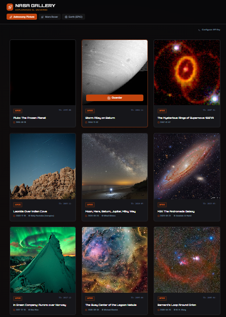
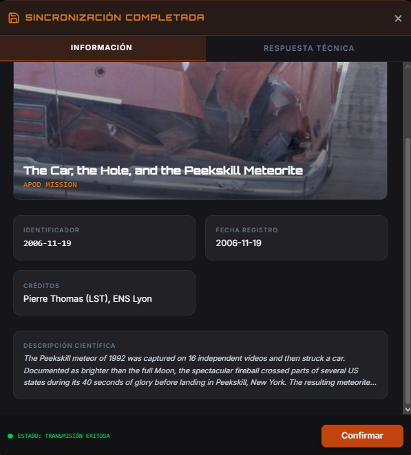
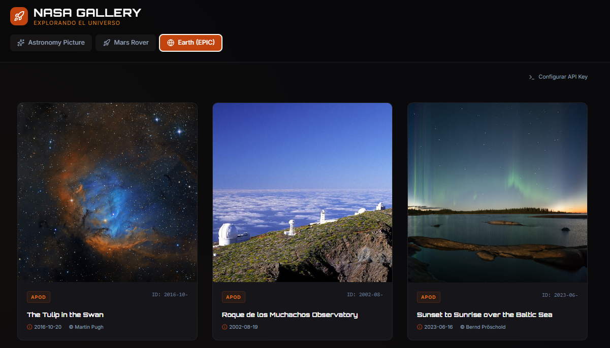
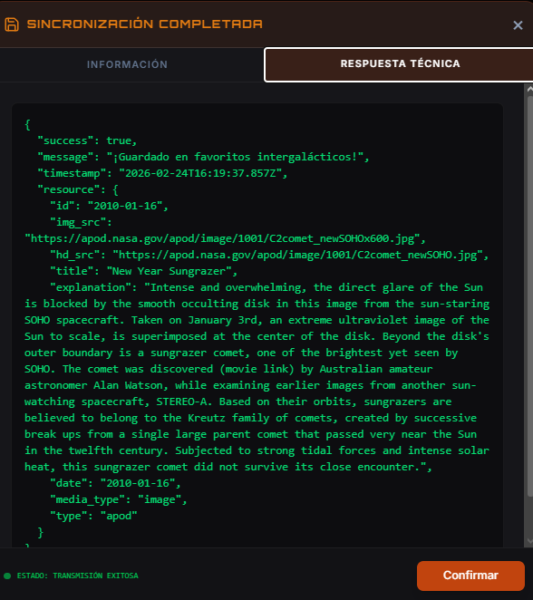

#  NASA Explorer - Multi-Mission Gallery

Aplicación académica de alto nivel desarrollada con **React** y **Tailwind CSS** que integra múltiples flujos de datos en tiempo real de la NASA para ofrecer una experiencia inmersiva del espacio.

## Capacidades de la API de la NASA
Esta aplicación ha evolucionado para consumir tres servicios fundamentales de la NASA Open API:

1.  **APOD (Astronomy Picture of the Day)**: Recupera las imágenes astronómicas más impactantes con sus explicaciones científicas.
2.  **Mars Rover Photos**: Acceso a la biblioteca visual de la misión **Curiosity** en Marte (específicamente Sol 1000).
3.  **EPIC (Earth Polychromatic Imaging Camera)**: Imágenes a color real de la Tierra capturadas desde el satélite DSCOVR.

- **Endpoint Base:** `https://api.nasa.gov`
- **Robustez de Conexión:** Implementa un sistema de triple capa (Llave Personal -> DEMO_KEY -> Modo de Respaldo Offline) para garantizar que la aplicación siempre sea funcional.

##  Operaciones de Datos (GET vs POST)

La arquitectura sigue los principios REST para la gestión de recursos:

### 1. Método GET (Obtención y Sincronización)
Utilizado para recuperar recursos multimedia y metadatos desde los servidores de la NASA.
- **Optimización:** Implementa forzado de **HTTPS** en todas las URLs de recursos para evitar bloqueos por contenido mixto y un sistema de **Saneamiento de Datos** para unificar estructuras de diferentes APIs.
- **Manejo de Estados:** Control total sobre estados de carga (LCP), errores de red y límites de tráfico (Rate Limiting).

### 2. Método POST (Simulación de Persistencia)
Simula el guardado de recursos en una base de datos de "Favoritos Intergalácticos".
- **Visualización Pro:** Al hacer clic en "Guardar", se dispara una petición asíncrona que devuelve un payload JSON detallado, visible a través de un **Modal de Consola de Desarrollador**.

## Requisitos e Instalación

### Prerrequisitos
- Node.js (versión 18 o superior)
- Una API Key de [NASA APIS](https://api.nasa.gov/) (Opcional, la app incluye fallbacks)

### Pasos para ejecutar
1. **Configurar Entorno**: Crea un archivo `.env` basado en `.env.example` e inserta tu `VITE_NASA_API_KEY`.
2. **Instalar dependencias**:
   ```bash
   npm install
   ```
3. **Iniciar el servidor**:
   ```bash
   npm run dev
   ```
4. **Build de Producción**:
   ```bash
   npm run build
   ```

## Capturas del Proyecto (Placeholders)




---
**Desarrollado para Programación Internet**  
*Enfoque en Responsividad, Arquitectura Modular y Experiencia de Usuario.*
