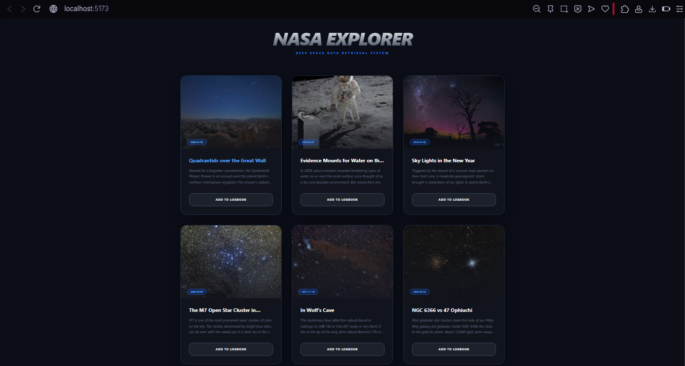
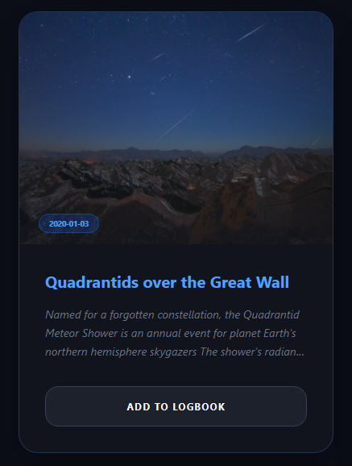
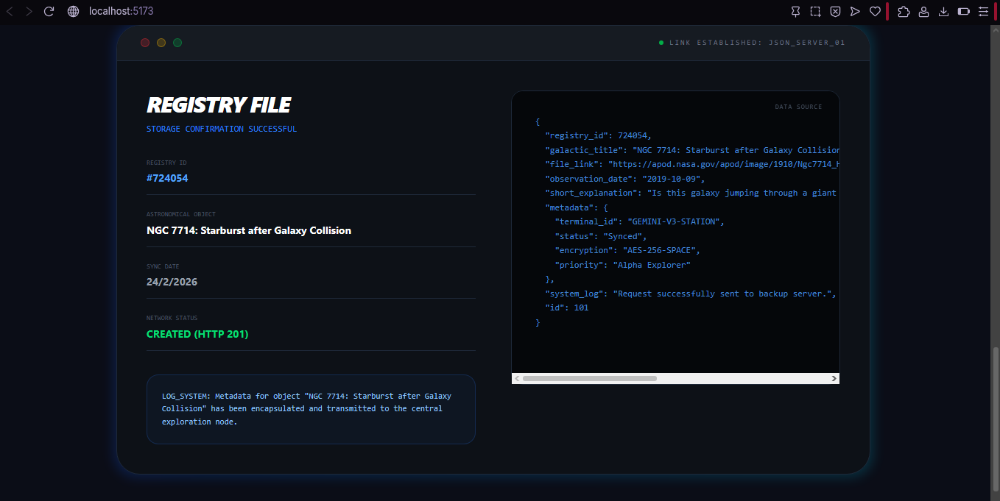

#  Project Documentation: NASA Explorer Dashboard

## 1. Work Description

This project consists of the development of a technically and visually advanced web application that functions as a **Real-Time Space Explorer**. The primary goal is to demonstrate the ability to integrate external services (APIs) for the management of scientific data.

### Key Features:
- **Dynamic Gallery**: Visualize images captured by NASA satellites and telescopes
- **Observation Logbook**: Simulate data transmission and registration to an external server
- **Full Client-Server Cycle**: Complete GET and POST methods implementation


*Replace with screenshot of the NASA Explorer Dashboard landing page*

---

## 2. Technologies Used

A modern, high-performance development stack was used to build this system:

| Technology | Purpose |
|-----------|---------|
| **React 19** | Core library for the component-based user interface |
| **Vite** | Lightning-fast build tool and development server |
| **TypeScript** | Static typing for reduced bugs and better maintainability |
| **Tailwind CSS v4** | Next-generation CSS for responsive design and space-tech aesthetic |
| **Axios** | Promise-based HTTP client for API communication |
| **Gemini (Google AI)** | Architecture assistant and development aid |

---

## 3. Functionality

### A. Data Retrieval (GET Method)

**What it does:** Fetches technical information and high-resolution images directly from NASA's database.

**How it does it:** Makes asynchronous requests to the `planetary/apod` endpoint.

**Through what:** The `getNasaData` function in the service layer, sending a private `API_KEY` and `count=6` parameter for randomized results.

#### Code Snippet:
```typescript
export const getNasaData = async () => {
  // Executes the asynchronous request via Axios
  const response = await axios.get(`${BASE_URL}?api_key=${API_KEY}&count=6`);
  return response.data; // Returns JSON object with images and info
};
```

**CSS Visualization:** Retrieved data is mapped into a responsive Grid system.


*Screenshot of the NASA images gallery displaying fetched data*

---

### B. Logbook Registration (POST Method)

**What it does:** Sends selected image data to "save" it into an official registry.

**How it does it:** Captures the JSON object of the selected image and constructs a new payload with additional metadata (Registry ID and sync timestamp).

**Through what:** Uses Axios POST method to a testing API (jsonplaceholder).

#### Code Snippet:
```typescript
export const postTestData = async (item: any) => {
  const payload = {
    registry_id: Math.floor(Math.random() * 900000),
    galactic_title: item.title,
    status: "Synced"
  };
  // Transmits the data via POST request
  const response = await axios.post('https://jsonplaceholder.typicode.com/posts', payload);
  return response.data; // Server returns created object with new ID (Status 201)
};
```

---

### C. User Interface and Styling (CSS)

**What it does:** Transforms raw JSON text into an immersive visual experience.

**How it does it:** Applies Tailwind CSS classes that react to React states (loading, isPosting, etc.).

**Through what:** Flexbox, CSS Grid, and CSS Transitions.

#### Visual Breakdown:
- **Loading States**: CSS-animated spinner displayed during GET requests (`animate-spin`)
- **Interactivity**: NASA images scale smoothly on hover (`hover:scale-110`)
- **Response Terminal**: Server log displayed in monospace fonts with glowing borders (simulating a command console)


*Screenshot of the interactive UI with loading states and hover effects*

---

## 4. Data Flow (Architecture)

### Information Journey from Space to Screen:


```
1. React requests data (GET)
   ↓
2. NASA API responds with JSON
   ↓
3. CSS receives JSON → Renders gallery with modern styling
   ↓
4. User clicks button → React sends data (POST)
   ↓
5. Server confirms registry
   ↓
6. CSS displays result → Galactic Registry File shows server response JSON
```


*Screenshot showing the Observation Logbook with server response*