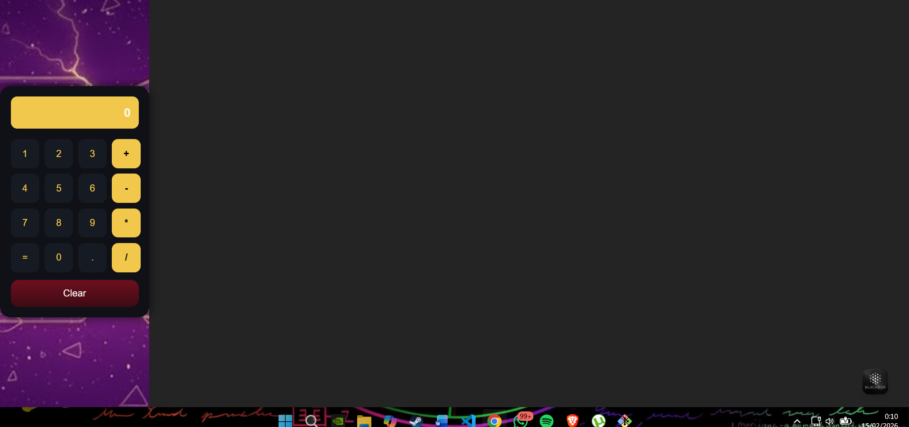

# 🧮 Calculadora en React + TypeScript

Proyecto de una calculadora web desarrollada con React y TypeScript utilizando Vite.  
Incluye diseño moderno, fondo personalizado y operaciones matemáticas básicas.

---

##  Descripción

Esta aplicación es una calculadora interactiva creada como práctica de desarrollo frontend.  
Permite realizar operaciones matemáticas básicas mediante una interfaz visual moderna con botones y pantalla digital.

---

## 🎯 Objetivo del proyecto

- Aprender el uso de React con TypeScript
- Comprender la estructura de un proyecto con Vite
- Implementar componentes reutilizables
- Aplicar estilos CSS modernos
- Manejar estados con useState
- Desarrollar lógica básica de una calculadora

---

## 🚀 Tecnologías utilizadas

- React
- TypeScript
- Vite
- CSS

---

## 📂 Estructura del proyecto

p4-calculadora/
│
├── public/
│ └── fondo.jpg
│
├── src/
│ ├── components/
│ │ ├── Calculator.tsx
│ │ └── calculator.css
│ │
│ ├── App.tsx
│ ├── App.css
│ ├── index.css
│ └── main.tsx
│
└── README.md


---

## ⚙️ Instalación

Crear el proyecto con Vite:

```bash
npm create vite@latest p4-calculadora -- --template react-ts


🧠 Funcionamiento de la calculadora

La aplicación permite:

1: Ingresar números mediante botones.

2: Seleccionar operadores matemáticos (+, -, *, /).

3: Visualizar la operación en pantalla.

4: Obtener el resultado al presionar "=".

5: Limpiar la pantalla con el botón "Clear".


Errores encontrados durante el desarrollo

Durante la creación del proyecto surgieron varios problemas técnicos:

1. Fondo no se mostraba

Causa: la imagen estaba en una ruta incorrecta.

Solución: mover la imagen a la carpeta public y usar:

background-image: url("/fondo.jpg");


2. La calculadora aparecía pegada a la izquierda

Causa: estilos por defecto de Vite en index.css.

Solución: eliminar estilos y configurar altura y ancho completos:

html, body, #root {
  height: 100%;
  width: 100%;
} 
``` 

---

## 📸 Captura del proyecto



##
casi por acabar lapantalla se puso en blanco 
 ##


 
