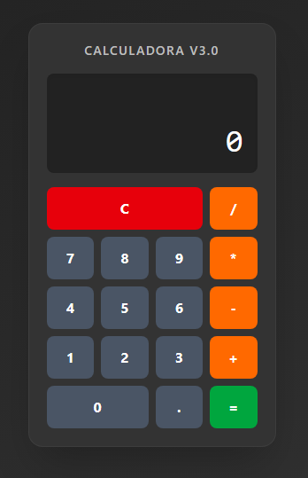

# Documentación del Proyecto: Calculadora V3.0
Tecnologías: React + Vite + TypeScript + Tailwind CSS (v4/v3.4)

## 1. Configuración del Entorno de Desarrollo
Antes de tocar el código, necesitamos preparar el sistema operativo con las herramientas de ejecución.

### A. Gestión de Node.js con NVM
Se recomienda el uso de NVM (Node Version Manager). Esto permite cambiar entre versiones de Node fácilmente, algo vital para evitar errores de compatibilidad como el Abort trap: 6 visto en sistemas antiguos.

- En Windows: Descarga nvm-windows desde su repositorio oficial en GitHub.

- En Mac/Linux: Instala nvm usando el script de **curl** o **wget** disponible en su documentación.

- Instalación de la versión recomendada:

```js
Bash

- Para máxima compatibilidad (como en Mac)
  nvm install 20
  nvm use 20

- Para las últimas funciones (como en tu Windows)
  nvm install 24
  nvm use 24
```
### B. Node.js y NPM
Al instalar Node a través de NVM, NPM (Node Package Manager) se instala automáticamente.

- Node.js: Es el entorno que permite ejecutar JavaScript fuera del navegador.

- NPM: Es el gestor que descarga las librerías (como Tailwind o React).

## 2. Creación del Proyecto con Vite
Vite es el "bundler" o "build tool" moderno que reemplaza a create-react-app. Es significativamente más rápido.

#### A. Generar la estructura:
```js
Bash

npm create vite@latest tu-carpeta -- --template react-ts
```
tu-carpeta: Nombre de la carpeta (debe coincidir con tu repositorio).

--template react-ts: Configura el proyecto con React y TypeScript desde el inicio.

#### B. Entrar e instalar dependencias base:
```js
Bash

cd p4-react
npm install
```
### 3. Instalación de Tailwind CSS
Dependiendo de tu sistema operativo, el proceso varía para asegurar la estabilidad:

#### Opción 1: Tailwind v4 (Recomendado para Windows Moderno)
Es la versión más rápida y no requiere archivos de configuración extensos.
```js
Bash

npm install tailwindcss @tailwindcss/vite
```
Configuración en vite.config.ts:
```js
TypeScript

import tailwindcss from '@tailwindcss/vite'
// ... añadir tailwindcss() en el array de plugins
```
#### Opción 2: Tailwind v3.4 (Recomendado para Mac Antiguo)
Evita el uso de binarios que requieren macOS 13+.
```js
Bash

npm install -D tailwindcss@3.4 postcss autoprefixer
npx tailwindcss init -p
```
### 4. Documentación del Código (App.tsx)
El corazón de la aplicación es un componente funcional de React que utiliza Hooks para gestionar la lógica matemática y el historial visual.

### Arquitectura de la Lógica
#### A. Gestión de Estados (Hooks)
- **valorActual:** Un string que muestra lo que el usuario ve en pantalla. Se usa string para facilitar la concatenación de números (ej: "1" + "2" = "12").

- **valorAnterior:** Almacena el número previo cuando se pulsa un operador.

- **memoria**: Gestiona el rastro visual de la operación (ej: "10 + 5 =").

#### B. Flujo de Operación
1. Entrada: El usuario pulsa un número -> presionarNumero actualiza el string.

2. Operación: Al pulsar +, -, etc. -> manejarOperacion guarda el valor actual, define la operación y limpia la pantalla principal.

3. Cálculo: La función realizarCalculo procesa los datos mediante un switch para devolver el resultado aritmético.

4. Finalización: calcularResultado cierra la operación, actualiza la memoria con el símbolo = y muestra el total en grande.

### Interfaz y Estilos (UI)
Se utiliza un sistema de Grid de Tailwind CSS para alinear los botones:

- Contenedor Principal: Un min-h-screen con degradado para centrar la calculadora.

- Pantalla: Un div con flex-col y justify-end para que los números siempre aparezcan pegados a la derecha y abajo, imitando una calculadora real.

- Botones: Se definen constantes (btnNum, btnOp) para aplicar estilos de forma masiva, incluyendo efectos hover y active:scale-95 para feedback táctil.


### 5. Resultado del proyecto
